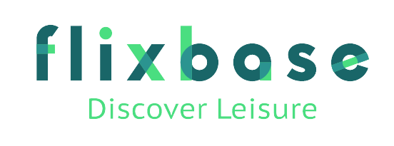

---
> ## App Description
Flixbase is a web app, a comprehensive and user-friendly platform for movie and TV show fans. 
 
It offers an extensive library of titles, providing detailed information on the plot, cast, release date, ratings, and related media, as well as related videos and images to give users a more immersive experience. 

The app allows users to browse by genre or by top-rated, upcoming, and recommended titles, making it easy to discover new and exciting content. 

Additionally, users have the ability to like and add titles to their wishlist, allowing them to keep track of their favorite shows and movies, and ensuring they never miss a new release. Whether you're a die-hard fan or just looking for your next binge-worthy show, this app has everything you need to satisfy your entertainment cravings and keep track of your movie and TV show wishlist.
___

> ## Tech Stack Used

___

## Features of the app
1. **` Discover Movies and TV Shows `** by genre and different sections like top-rated movies, upcoming movies, currently playing movies etc.
2. **` Search Option `**: User can use the search bar to look for any movie or tv show
3. **` The Landing Page Carousal `**: The carousal features five top-rated movies and five top-rated tv shows, and on each request, different items are pulled from the TMDB API.
4. The rest of the landing page features movies and tv shows by different sections .
5. The app has **` Pagination `** for each of the sections and genres built in, shows 20 items in each page.
6. The **` Footer `** has all the links available on the app.
7. The app also has **` Authentication `** and offers additional features upon authentication.
8. Each movie and tv show correspond to an `ID` using which the item is fetched from the API, and the route is as such `movies/id` and `series/id` for eg `series/41727`
9. The single movie / tv show page have the same layout.
   1.  The **`Hero Section`**, where most of the details of the title could be found like the title name, the overview, the tagline, the runtime, average rating etc.
   2.  Scrolling little down, we can find the **` Image Gallery `**: users can scroll through the horizontal gallery using `SHIFT + MOUSE WHEEL` or use the arrows provided.
   3.  The image gallery has *modal feature*, meaninig upon click on a image, the pop-up modal is viewed with the image clicked, the user can now view all the images from the gallery with simple navigation.
   4.  Then we have the **` Cast Section `**, with avatar of the cast and also the name.
   5.  Then we have the videos related to the title. As this is pulled out from the API, this might not always return the desired result like trailers and such.
   6.  After that we have the **` Recommended `** and **` Suggested `** titles section, the titles here are strongly related to the title in question, it helps when user wants to see something realted to the said title.
   7.  Then we come to the **` Reviews Section `** : This section also has the same *modal feature*, upon click on which it opens the specific review that the user has clicked on.
10. Not to mention, the whole app is **` Fully Responsive `**, built with mobile first approach.
11. The user **` Upon Authentication `** can add a movie or a tv show to the liked-list or the watchlist to binge watch later, and would not need to scramble google finding a good movie or a tv show to watch.
12. The user can also navigate to the `/user` page, located on the navbar's user avatar/title of the avatar, where the user can view all the saved content and delete them as needed.
13. The user has the option to login to the app using `Google` or `Github`.
14. The user can logout of the app in the `/user` page.
___
## Environmental Variables Used

- NEXT_PUBLIC_SERVER_URL: The base address of the app, if running locally, for example `http://localhost:3000`
- NEXT_PUBLIC_API_KEY: The TMDB API Key
- GOOGLE_CLIENT_ID: Google client ID for user authentication, can be obtained from google console
- GOOGLE_SECRET: Google secret for user authentication, can be obtained from google console
- GITHUB_CLIENT_ID: Github client ID for user authentication, this can be obtainer from `https://github.com/settings/applications/new`, you would need to register a new application.
- GITHUB_SECRET: Github secret for user authentication, can be obtained post registration of the application of the app
- DB_URL: The mongodb cloud database url. Here I have used `MongoDB Atlas`, other products could also be used if desired, make sure the admin user is created and the user name and password is included in the connection string.
___
## Knows Technical / UI Bugs
- [ ] FIX: Sections having title cards using grid's auto-fit causes the card to span the whole space, rather use flex wrap to prevent the span.
- [ ] FIX: The image slider in `/series/id` not working
- [ ] FIX: Add `More` button to sections in the landing page